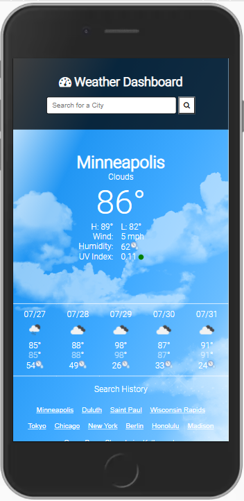

# Weather-Dashboard

> Outline a brief description of your project.
> Live demo [_here_](https://kabaothao.github.io/Weather-Dashboard/). <!-- If you have the project hosted somewhere, include the link here. -->

## Table of Contents

- [General Info](#general-information)
- [Technologies Used](#technologies-used)
- [Features](#features)
- [Screenshots](#screenshots)
- [Setup](#setup)
- [Usage](#usage)
- [Acknowledgements](#acknowledgements)
- [Contact](#contact)
<!-- * [License](#license) -->

## General Information

- This project is designed to to retrieve weather data for cities.
- What is the purpose of your project?
  To access to third-party APIs and functionality by making requests with specific parameters to a URL.
- Why did you undertake it?
  To incorporate Moment.js library to work with date and time.

<!-- You don't have to answer all the questions - just the ones relevant to your project. -->

## Technologies Used

- HTML5
- CSS
- Javascript
- Visual Studio

## Features

List the ready features here:

- FontAwesome.com
- Moment.js.com
- Openweathermap.org

## Screenshots

<!-- If you have screenshots you'd like to share, include them here. -->

## Setup

What are the project requirements/dependencies? Where are they listed? Where is it located? Proceed to describe how to install / setup one's local environment / get started with the project.

- The URL of the deployed application.
- The URL of the GitHub repository. Give the repository a unique name and include a README describing the project.

## Usage

How does one go about using it?

- To search a city in order to generate a weather dashboard that will run in the browser and feature dynamically updated HTML and CSS.

For example:

let getWeatherForecast = function (city) {
if (city) {
cityInputEl.value = city;
}
urlWeather = `https://api.openweathermap.org/data/2.5/weather?q=${cityInputEl.value}&appid=${apiKey}&units=imperial`;

setWeatherForecast();
};

## Acknowledgements

Give credit here.

- This project was inspired by Trilogy Education.
- Many thanks to Trilogy Education.

## Contact

Created by [@kabaothao](https://github.com/kabaothao) - feel free to contact me!

<!-- Optional -->
<!-- ## License -->
<!-- This project is open source and available under the [... License](). -->

<!-- You don't have to include all sections - just the one's relevant to your project -->
